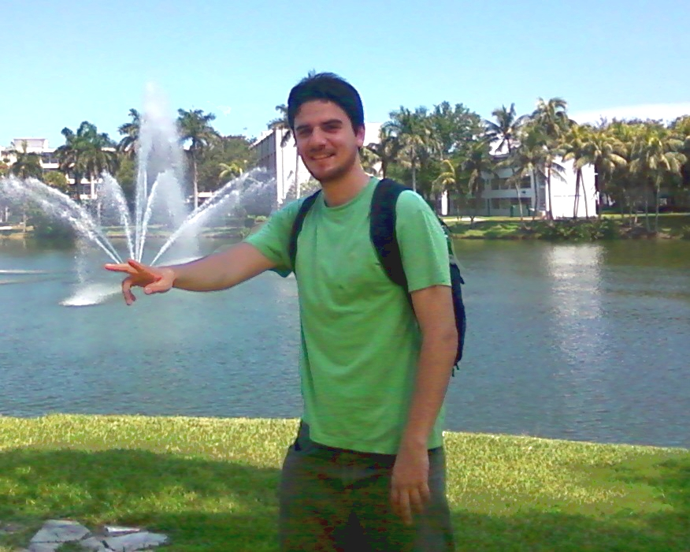

## Bio
I started my audio-related education some years ago when I studied the BSc in Sound Engineering at Vicente Pérez Rosales University, which is a five years program that comprises Music, Electronics, Computer Programming, DSP, Acoustics, Music Recording, and so on. In the beginning, my main interest was studio recording, so I worked in many music productions involving a wide range of musical styles, like Rock, Hip-Hop, Funk, Electronica, Trip-Hop, etc. As a student, I was awarded twice for my musical productions; one of them judged by the recording engineer Barry Sage.  You can listen to one of my old productions here (link).

|| In a certain point, after taking Computer Programming, Digital Signal Processing (DSP) and Acoustics courses, I realised that I actually wanted to build the audio equipment that I used to work with, rather than being just a normal user. Consequently, my undergrad thesis was about the development of a VST/RTAS audio plug-in for Digital Room Correction (DRC) intended for multi-track recording sessions.|

The knowledge and skills that I acquired while carrying out my thesis encouraged me to learn more about audio technology research and development. After graduation, I decided to do a master degree abroad, since there were not audio technology-related postgraduate programs in Chile at that time. Then, after a couple of years, I obtained a scholarship to study the MSc program in [Music Engineering Technology at University of Miami, FL.](http://mue.music.miami.edu/about/){:target="_blank"}, which was the first audio technology master program in the USA, and had been directed by Ken Pohlmann for thirty years, and currently hosted by prestigious professors as Dr. Colby Leider and [Will Pirkle](http://www.willpirkle.com/){:target="_blank"}.

So far, I have worked doing different things. From my creative side,  I have produced and recorded music, performed as a singer, did live sound, etc. As a teacher, I have taught several courses such as Pure Data, MIDI, Pro Tools, Audio Plug-in Design, DSP Workshop, and so on. As a developer, I have made several tools for audio analysis, processing and synthesis, I did an internship at Bose Corp., and I participated on the development of a robot for the automation of tests for point of service machines. Also, I was working at the [Speech Processing And Transmission Lab](https://www.lptv.cl/){:target="_blank"} at University of Chile as a researcher engineer, where I explored new feature extraction techniques for text-dependent and text-independent speaker verification systems, and the applications of ultrasound in automatic bubble sizing, whose results were published in peer-reviewed journals.

Currently, I am a PhD student in the [Centre of Speech Technology Research (CSTR)](http://www.cstr.ed.ac.uk/){:target="_blank"} under the supervision of Professor [Simon King](http://homepages.inf.ed.ac.uk/simonk/){:target="_blank"} at The University of Edinburgh, where I am conducting research on new signal representations and acoustic modelling for statistical parametric speech synthesis.