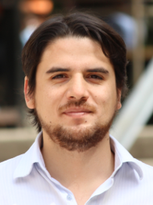

| Welcome to my website. I am an audio/speech technology developer and researcher. Currently, I am doing my PhD at the [CSTR-University of Edinburgh](http://www.cstr.ed.ac.uk/), where I research on new signal representations and acoustic modelling for statistical parametric speech synthesis. Also, my interests cover a wide range of disciplines, such as Music, Digital Audio, real-time audio effects, Computer Programming, Acoustics, and so on. You will find on this website information about me, including education, publications, projects, trips, and especially the stuff that I love the most: __Audio Technology Development !!__ | |

## Publications

- C. Valentini-Botinhao, O. Watts, F. Espic, and S.King,  “Examplar-based speech waveform generation for text-to-speech,” In Proc. 2018 IEEE Spoken Language Technology Workshop (SLT), Athens,  Greece, December, 2018. [[pdf]](https://ieeexplore.ieee.org/document/8639679){:target="_blank"}

- F. Espic, A. Govender, M. S. Ribeiro, C. Valentini-Botinhao, O. Watts, “The CSTR entry to the Blizzard Challenge 2018,” In Proc. Blizzard Challenge, Hyderabad, India, September, 2018. [[pdf]](http://www.festvox.org/blizzard/bc2018/CSTR_BlizzardChallenge2018.pdf){:target="_blank"}

- O. Watts, C. Valentini-Botinhao, F. Espic, and S. King “Exemplar-based Speech Waveform Generation,” in Proc. Interspeech, Hyderabad, India, September, 2018. [[pdf]](https://www.isca-speech.org/archive/Interspeech_2018/pdfs/1857.pdf){:target="_blank"} [[samples]](http://homepages.inf.ed.ac.uk/owatts/papers/IS2018_snickery){:target="_blank"} [[code]](https://github.com/CSTR-Edinburgh/snickery){:target="_blank"}

- S. Ronanki, M. S. Ribeiro, F. Espic, and O. Watts, “The CSTR entry to the Blizzard Challenge 2017,” In Proc. Blizzard Challenge, Stockholm, Sweden, August, 2017. [[pdf]](http://festvox.org/blizzard/bc2017/CSTR_Blizzard2017.pdf){:target="_blank"}

- F. Espic, C. Valentini-Botinhao, and S. King, “Direct Modelling of Magnitude and Phase Spectra for Statistical Parametric Speech Synthesis,” in Proc. Interspeech, Stockholm, Sweden, August, 2017. [[pdf, samples and code]](http://felipeespic.com/fft_feats_is17/){:target="_blank"}

- F. Espic, C. Valentini-Botinhao, Z. Wu, and S. King, “Waveform generation based on signal reshaping for statistical parametric speech synthesis,” in Proc. Interspeech, San Francisco, CA, USA, September, 2016. [[pdf]](http://www.isca-speech.org/archive/Interspeech_2016/pdfs/0487.PDF){:target="_blank"} [[samples]](http://felipeespic.com/demo_waveform_2016/){:target="_blank"} [[code]](https://github.com/CSTR-Edinburgh/WavGenSR){:target="_blank"}

- F. Villavicencio, J. Yamagishi, J. Bonada, and F. Espic, “Applying spectral normalisation and efficient envelope estimation and statistical transformation for the Voice Conversion Challenge 2016,” in Proc. Interspeech, San Francisco, CA, USA, September, 2016. [[pdf]](http://www.isca-speech.org/archive/Interspeech_2016/pdfs/0305.PDF){:target="_blank"}

- V. Poblete, F. Espic, S. King, R. M. Stern, F. Huenupan, J. Fredes, and N. Becerra Yoma, “A perceptually-motivated low-complexity instantaneous linear channel normalization technique applied to speaker verification,” Computer Speech and Language, Volume 31, Issue 1, Pages 1-27, 2015. [[pdf]](http://www.sciencedirect.com/science/article/pii/S0885230814001053){:target="_blank"}

- W. Hussein, S. M. Khan, J. Zamorano, F. Espic, and N. Becerra Yoma, “A novel ultrasound based technique for classifying gas bubble sizes in liquids,” Measurement Science and Technology, 25, no. 12, 2014. [[pdf]](http://iopscience.iop.org/article/10.1088/0957-0233/25/12/125302){:target="_blank"}

### Other publications and talks

-F. Espic, C. Valentini-Botinhao, and S. King,  “MagPhase Vocoder: Magnitude and phase analysis/synthesis for statistical parametric speech synthesis,” UK-Speech Conference, Cambridge, UK, September, 2017.

- S.King, O. Watts, S. Ronanki, Z. Wu, and  F. Espic “Tutorial: Deep Learning for Text-to-Speech Synthesis, using the Merlin toolkit,” Interspeech Conference, Stockholm, Sweden, August, 2017. [[slides and videos]](http://www.speech.zone/courses/one-off/merlin-interspeech2017/){:target="_blank"}

- F. Espic, “A Survey About IFIR Filters and Their More Recent Improvements,” report, University of Miami, 2011. Cited in the book “[Digital Signal Processing with Matlab Examples, Volume 1](http://www.springer.com/in/book/9789811025334){:target="_blank"}” by Jose Maria Giron-Sierra, Springer, 2017. [[pdf]](http://felipeespic.com/depot/docs/DSP_CS1.pdf?x56455){:target="_blank"}

- F. Espic, Talk on Waveform generation based on signal reshaping for statistical parametric speech synthesis. UK-Speech Conference, Sheffield, UK, June, 2016. [[video]](/demos){:target="_blank"}

- F. Espic, “A Phrase Recognition System Intended for Musical Applications,” report, University of Miami, 2011. [[pdf]](http://felipeespic.com/depot/docs/Phrase_ASR.pdf){:target="_blank"}

- F. Espic, “A Simple Music Transcription Method Using Comb Filter Techniques and Envelope Detection,” report, University of Miami, 2011.  [[pdf]](http://felipeespic.com/depot/music_trans/docs/music_trans.pdf){:target="_blank"}

